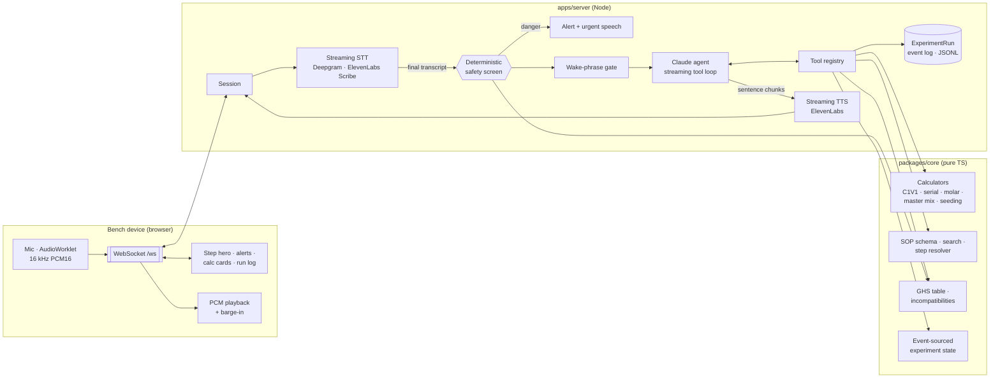

# Architecture

voicelab is a **cascaded** real-time voice pipeline (speech-to-text → Claude with
lab tools → text-to-speech) wrapped around a **deterministic lab core**. The
LLM handles language and judgment. Numbers, safety rules and run state come from
plain, tested code it calls as tools.

## Packages

| Path | Role | Runtime |
|---|---|---|
| `packages/core` | Protocol types, SOP schema + parsing/search, unit-aware calculators, safety rules, event-sourced experiment state, run report renderer | Browser-safe TS (`@voicelab/core`); `@voicelab/core/node` adds filesystem SOP loading |
| `apps/server` | HTTP + WebSocket server, session orchestration, STT/TTS adapters, Claude agent + offline agent, tool registry, JSONL persistence, SOP import CLI | Node 22 via `tsx` |
| `apps/web` | Bench UI: mic capture, PCM playback, barge-in, browser speech fallbacks, step hero, alerts, calc cards, run panel | Vite + React |
| `sops/` | Structured SOPs in YAML (demo content) | Data |
| `docs/` | Product, provider research, safety/compliance, discovery plan, roadmap | Docs |

## A turn, end to end

1. **Capture.** The browser streams 16 kHz PCM16 frames over the socket (or, in
   browser-STT mode, sends final transcripts as `user.text`).
2. **Transcribe.** The server's STT adapter streams partials (`transcript`,
   `final: false`) and emits a final on endpointing or push-to-talk release.
   Keyterms from the active SOP (reagent names, aliases, units) are passed to
   the provider so lab jargon transcribes correctly.
3. **Safety screen (before any LLM).** `screenUtterance()` runs on every final
   utterance, even ones the wake phrase will drop. A `danger` finding is
   spoken right away, pinned in the UI until acknowledged, and written to the
   run log. The LLM is never the only safety layer.
4. **Gate.** In hands-free mode with a wake phrase set, utterances that are not
   addressed to the assistant become `transcript.ignored`.
5. **Agent turn.** Claude gets a stable system prompt (persona, rules, and the
   full SOP rendered by `renderSopForPrompt`, prompt-cached) plus a per-turn
   `<bench_state>` block in the user message (current step, recent readings,
   timers, open deviations). It streams text and calls tools. All arithmetic
   goes through calculator tools, and their `spoken` strings are what gets said.
6. **Check numbers, then speak.** Text deltas are cut into sentences. Before a
   sentence goes to TTS, every number in it is checked against what can back
   it: tool inputs and outputs, the SOP, run events, and what the operator said
   (allowing unit rescaling and rounding). An unbacked number raises a
   "Check this number" warning and adds a spoken caveat at the end of the turn.
   The first audio starts after the first sentence instead of the full reply.
   PCM is sent as binary frames between `tts.start` / `tts.end`.
7. **Barge-in.** If the operator talks over the assistant (client-side RMS
   detection) or presses Stop, the client sends `interrupt`. The server aborts
   the Claude stream and the TTS, and the turn ends with `interrupted: true`.
8. **Record.** Every mutation is a `LabEvent` appended to the run. Listeners
   push `state`/`event` to the UI and append JSONL to
   `data/sessions/<runId>.jsonl`. `renderRunReport()` turns the log into an
   ELN-ready Markdown record.

## Design decisions

**Cascaded pipeline, not speech-to-speech.** We need reliable tool use for
calculations, a deterministic safety layer *in* the loop, provider
swap-ability, and ownership of the event stream (the data asset). Speech-to-
speech models are lower latency but make all of these harder. See
[providers.md](providers.md) for the trade-off and the experiments worth running.

**Numbers only from tools.** The system prompt forbids mental math. Calculators
return a display `summary`, a TTS-ready `spoken` phrase, the `working`, and
practical warnings (sub-microliter volumes, pipette choice). The UI shows the
working so the scientist can verify before pipetting.

**Number provenance as a backstop.** Claude Opus 5.5 can't be forced to call
a tool (`tool_choice: any` returns a 400), so "numbers only from tools" is a
prompt instruction plus a server-side check (`apps/server/src/agent/provenance.ts`),
not a guarantee from the model.

**Structured SOPs.** Plain-text SOPs can't tell you that an A595 of 1.9 is out
of range. The YAML schema adds expected measurement ranges, hazards (GHS codes),
timers, critical steps, checks and troubleshooting, which is what turns
"read the SOP back" into "tell me when something is going wrong". The
`sop:import` CLI uses Claude structured outputs to convert existing PDFs/text
into this format, which then gets human review.

**Event sourcing.** State is `events.reduce(applyEvent)`. One log gives us the
live UI, persistence, replay, the run record, and analytics on how protocols
are actually executed (step durations, where deviations cluster).

**Graceful degradation.** Every provider has a fallback. With no API keys the
app still runs end to end: browser Web Speech STT/TTS and a rule-based offline
agent that calls the same tools. That covers demos, tests and air-gapped labs.

## Latency budget (target: < 1 s from end of speech to first audio)

| Stage | Target | Lever |
|---|---|---|
| STT endpointing → final | 200–400 ms | Provider endpointing settings; push-to-talk release finalizes immediately |
| Safety screen | < 5 ms | Pure regex/table lookups |
| Claude time-to-first-token | 300–600 ms | `effort: low`, prompt caching on system + SOP, short history |
| First sentence complete | +100–300 ms | Sentence chunker flushes on first `.?!` or a clause boundary |
| TTS time-to-first-byte | 75–250 ms | Low-latency TTS model, PCM output (no decode) |

Tool calls (calculations) add a round trip. That's acceptable because the answer
is the number itself, and the UI shows the calc card the moment the tool returns.

## Protocol

See [`packages/core/src/protocol.ts`](../packages/core/src/protocol.ts). It is a
single WebSocket. Text frames are JSON messages and binary frames are PCM16
audio (mic at 16 kHz upstream, TTS at the announced sample rate downstream).

## Extending

- **New STT/TTS provider:** add an adapter under `apps/server/src/providers/`
  that implements the interface, then register it in `config.ts`.
- **New tool:** add it to the tool registry (zod schema plus handler over core).
  Both the Claude and offline agents pick it up.
- **New SOP:** drop a YAML file in `sops/` (or run `sop:import`). It is
  validated on load.
- **Manufacturing:** same core. Swap SOPs for batch records/work instructions,
  add MES/instrument adapters as tools, and add e-signature gates on critical
  steps (see [safety-and-compliance.md](safety-and-compliance.md)).
